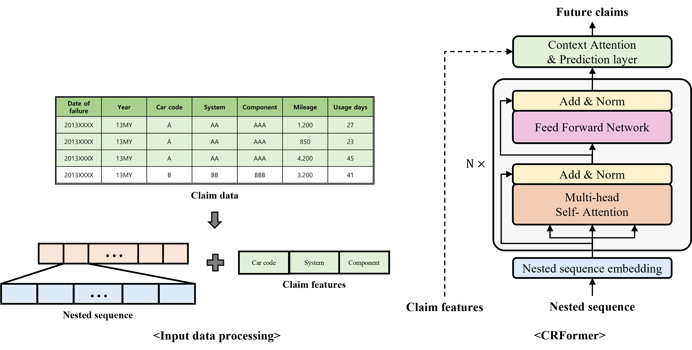

# CRFormer: Complementary Reliability perspective Transformer (IEEE ACCESS)

This is a Pytorch implementation of [CRFormer: Complementary Reliability perspective Transformer for Automotive Components Reliability Prediction Based on Claim Data](https://ieeexplore.ieee.org/document/9863836).

The overall architecture of CRFormer is as below:

	

