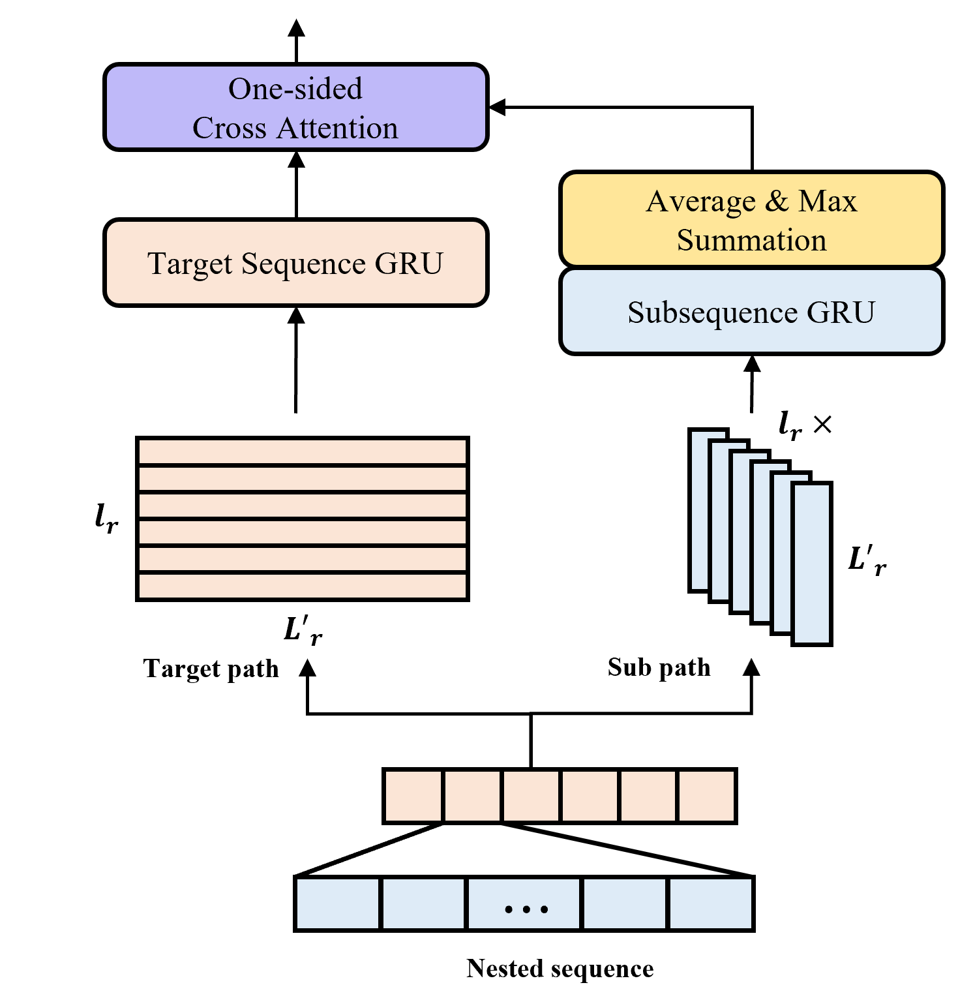
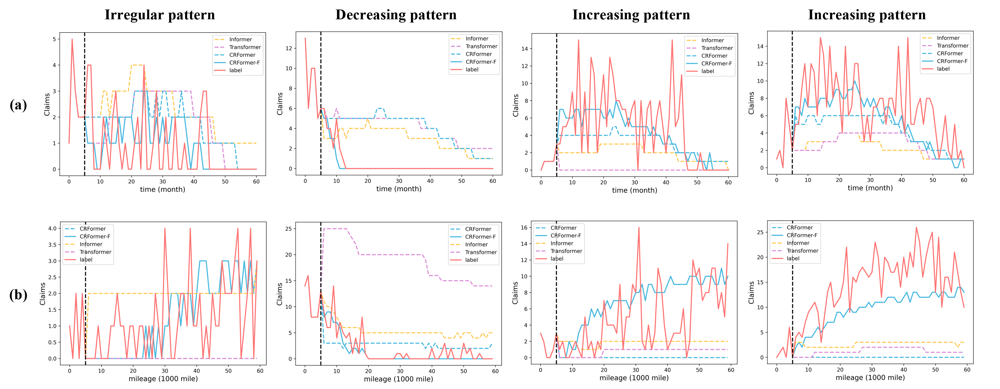

# CRFormer: Complementary Reliability perspective Transformer (IEEE ACCESS)

This is a Pytorch implementation of [CRFormer: Complementary Reliability perspective Transformer for Automotive Components Reliability Prediction Based on Claim Data](https://ieeexplore.ieee.org/document/9863836). The main idea of the paper is to represent both automobile reliabilities (time and mileage) for predicting future failures in respect of each reliability. CRFormer consists of a  Nested sequence embedding module, Transformer encoder, and context attention based decoder.

The overall architecture of CRFormer is as below:

<p align="left">
	
</p>

The figure of Nested sequence embedding is as below:

<p align="left">
	
</p>

# Installation & Enviornment

The OS, python and pytorch version needs as below:
- Windows
- Linux 
- python >= 3.7.4
- pytorch >= 1.7.1

# Details

## 0. Notifications

We use the claim data from 2006 to 2021 provided automobile company, but we do not provide the dataset in this repository.
Before we train CRFormer, we take some processes for set up.

- Depending on automobile reliabilities, we adopt a time-series K means cluster model for obtaining pattern information used for evaluation. 
- We take a process for generating two kinds of nested sequence (time- and mileage-based nested sequence) 

## 1. Train

### Training with arguments

We give a short description for arguments as belows.
You can find more details of arguments such as training and evaluation settings in ```config.py```.

```
python main.py train 

CRFormer arguments:
  --scaling    : input scaling option (default:False)
  --hidden_size: hidden size (default:256)
  --num_layers : number of layers for Transformer encoder (default:6)
  --d_ffn      : hidden size for Transformer ffn (default:256)
  --n_head     : number of head for multi-head attention (default:4)
  --d_k        : dimension for each head in multi-head attention (default:64)
  --dropout    : dropout ratio (default:0.3)
  --use_feat   : usage feature option for CRFormer-F (default:False)
  --features   : feature list of claim data 
```

## 2. Experimental Results

We provide visualizations of result samples. They are predicted by CRFormer, CRFormer-F, and other benchmark models.
(a) and (b) indicate prediction results for time (days) and mileage, respectively.

<p align="left">
	
</p>


## Citation

```
@article{park2022crformer,
  title={CRFormer: Complementary Reliability Perspective Transformer for Automotive Components Reliability Prediction Based on Claim Data},
  author={Park, Hyun Joon and Kim, Taehyeong and Kim, Young Seok and Min, Jinhong and Sung, Ki Woo and Han, Sung Won},
  journal={IEEE Access},
  volume={10},
  pages={88457--88468},
  year={2022},
  publisher={IEEE}
}
```

## License

This repository is released under the MIT license.
